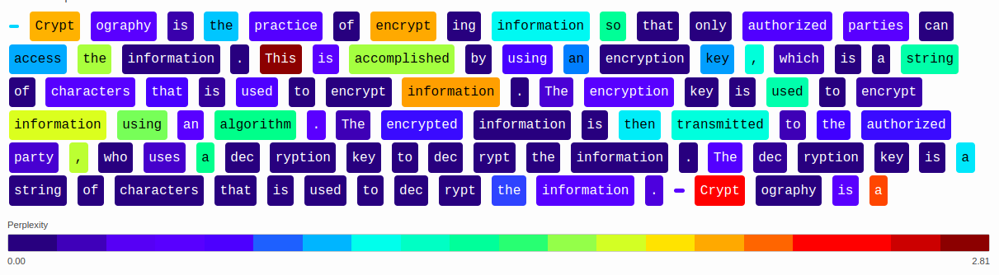

# HAIDI-Graphs

This is my semester project@EPFL on AI Safety.

Trying to find harmful content in the training data of LLMs by looking at their outputs. 

The code allows to run inference from models using the module `transformers`, and compute the perplexity of the output tokens. It can also generate visualization of the perplexity per token.



# Perplexity Analysis Toolkit

A comprehensive toolkit for analyzing token-level perplexity in language model generations, with support for low-perplexity region extraction, Infinigram corpus frequency analysis, and interactive visualizations.

## 📁 Project Structure

```
project_root/
├── experiments/                          # Experiment storage
│   ├── experiment_name/
│   │   ├── inference_data/
│   │   │   ├── generations/               # Model outputs with per-token perplexities
│   │   │   │   ├── prompt_001.json
│   │   │   │   ├── prompt_002.json
│   │   │   │   └── ...
│   │   │   └── metadata.json             # Experiment configuration (WIP)
│   │   ├── perplexity_analysis/
│   │   │   ├── low_perp_regions/         # Extracted low-perplexity regions
│   │   │   │   ├── prompt_001_regions.json
│   │   │   │   ├── prompt_002_regions.json
│   │   │   │   └── ...
│   │   │   ├── analysis_config.json      # Analysis parameters (WIP)
│   │   │   └── summary_stats.json        # Aggregate statistics (WIP)
│   │   └── experiment_log.json           # Experiment timeline and metadata
│   ├── exp_2 /
│   └── ...
├── src/
│   ├── infer.py           # Main inference script
│   ├── infinigram.py          # Infinigram API integration
│   ├── plot.py        # HTML visualization toolkit
├── configs/                             # Configuration templates
└── README.md
```

## 🚀 Quick Start

### 1. Installation

```bash
# Install required dependencies
pip install torch transformers requests tqdm matplotlib numpy

# Clone or download the toolkit
git clone https://github.com/Reliable-Information-Lab-HEVS/HAIDI-Graphs
cd HAIDI-Graphs
```

### 2. Basic Perplexity Analysis

```bash
# Single prompt
python src/infer.py \
    --model_name "EleutherAI/pythia-70m" \
    --prompt "The quick brown fox jumps over the lazy dog" \
    --experiment-name "test_experiment" \
    --n_gen 3 \
    --verbose

# Analyze multiple prompts from a JSON file
python src/infer.py \
    --model_name "EleutherAI/pythia-160m" \
    --prompt "prompts.json" \
    --experiment-name "batch_experiment" \
    --n_gen 5 \
    --window-size 8 \
    --perplexity_threshold 1.5
```

### 3. Add Infinigram Corpus Frequencies

```bash
# Process entire experiment directory
python src/infinigram.py experiments/test_experiment/ --confirm --verbose

# Process single file
python src/infinigram.py experiments/test_experiment/perplexity_analysis/low_perp_regions/prompt_001_regions.json
```

### 4. Generate Visualizations

```bash
# Create HTML visualization for entire experiment
python src/plot.py experiments/test_experiment/ --output results.html

# Visualize specific prompt
python src/plot.py experiments/test_experiment/ --prompt-id P001 --output prompt_001.html
```

## 📊 Data Formats

### Generation Data Format

```json
{
  "prompt_metadata": {
    "prompt_id": "P0002",
    "creation_date": "2025-06-13T12:16:23Z",
    "prompt_text": "Lebron James is"
  },
  "model_info": {
    "model_name": "EleutherAI/pythia-70m-deduped",
    "max_length": 100,
    "temperature": 0.4,
    "top_k": 20,
    "top_p": 0.8,
    "repetition_penalty": 1
  },
  "tokenizer_info": {
    "tokenizer_name": "EleutherAI/pythia-70m-deduped",
    "vocab_size": 50254,
    "special_tokens": {
      "bos_token": "<|endoftext|>",
      "eos_token": "<|endoftext|>",
      "pad_token": null,
      "unk_token": "<|endoftext|>"
    }
  },
  "generations": [
    {
      "generation_id": "P0002_G00",
      "generated_text": " a member of the International ...",
      "token_ids": [
        247,
        3558,
        273,
        253, # etc.
      ],
      "token_texts": [
        " a",
        " member",
        " of",
        " the",
        " International", # etc....
      ],
      "token_perplexities": [
        1.0,
        1.9969673910624095,
        1.0,
        1.0,
        1.0, # etc. ...
      ],
      "generation_params": {
        "seed": 42,
        "timestamp": "2025-06-13T12:16:26Z"
      }
    }
  ]
}
```

### Low Perplexity Regions Format

```json
{
  "source_prompt_id": "P0002",
  "analysis_metadata": {
    "analysis_date": "2025-06-13T12:16:23Z",
    "source_file": "inference_data/generations/prompt_002.json"
  },
  "analysis_parameters": {
    "window_size": 6,
    "perplexity_threshold": 1.0,
    "stride": 1
  },
  "per_prompt_regions": [
    {
      "generation_id": "P0002_G00",
      "per_gen_regions": [
        {
          "region_id": "P0002_G00_R01",
          "start_index": 19,
          "end_index": 25,
          "tokens": [
            " a",
            " member",
            " of",
            " the",
            " International",
            " League"
          ],
          "token_ids": [
            247,
            3558,
            273,
            253,
            5625,
            6884
          ],
          "is_contiguous": false,
          "is_in_prompt": false,
          "avg_perplexity": 1.0,
          "min_perplexity": 1.0,
          "max_perplexity": 1.0,
        }]
    }]
}
```

## 🛠️ Core src

### `perplexity_analyzer.py` - Main Analysis Script

Generates text using language models and computes per-token perplexity with low-perplexity region extraction.

**Arguments:**
```bash
--model_name TEXT          # HuggingFace model name or path
--prompt TEXT              # Single prompt or JSON file path
--n_gen INTEGER            # Number of generations per prompt
--max_length INTEGER       # Maximum generation length
--temp FLOAT               # Sampling temperature
--window-size INTEGER      # Low-perplexity window size
--perplexity_threshold FLOAT # Perplexity threshold for region extraction
--stride INTEGER           # Sliding window stride
--experiment-name TEXT     # Experiment directory name
--verbose                  # Enable detailed logging
```

### `infinigram.py` - Corpus Frequency Analysis

Integrates with the Infinigram API to add corpus frequency information to low-perplexity regions.

**Usage:**
```bash
# Process entire experiment directory
python src/infinigram.py experiments/test_experiment/ --confirm --verbose

# Process single file
python src/infinigram.py experiments/test_experiment/perplexity_analysis/low_perp_regions/prompt_001_regions.json

# Create copies instead of updating in place
python src/infinigram.py experiments/test_experiment/ --create-copy --confirm

# Custom API settings
python src/infinigram.py experiments/test_experiment/ \
    --index "v4_piletrain_llama" \
    --workers 5 \
    --retries 3 \
    --backoff 1.5
    ```

### `plot.py` - Interactive HTML Visualizations

Creates rich HTML visualizations of token perplexities with region highlighting and statistical summaries.

**Jupyter Notebook Usage:**
```python
from plot import TokenPerplexityVisualizer
from IPython.display import HTML

viz = TokenPerplexityVisualizer(cmap_name="viridis_r")
html = viz.load_and_visualize_experiment("experiments/my_exp/")
display(HTML(html))
```

**Bash usage:**
```bash
# Create HTML visualization for entire experiment
python src/plot.py experiments/test_experiment/ --output results.html

# Visualize specific prompt
python src/plot.py experiments/test_experiment/ --prompt-id P001 --output prompt_001.html

# Hide prompt text and show only first 3 generations
python src/plot.py experiments/test_experiment/ \
    --no-prompt \
    --max-generations 3 \
    --output summary.html

# Customize visualization appearance
python src/plot.py experiments/test_experiment/ \
    --colormap "viridis_r" \
    --font-size 14 \
    --no-regions \
    --output clean_viz.html
```

### Debug Mode

Enable verbose logging for all src:
```bash
# Detailed logging for debugging
python src/perplexity_analyzer.py --verbose [other args]
python src/infinigram.py --verbose [other args]
python src/plot.py --verbose [other args]
```

## 📝 Citation

If you use this toolkit in your research, please cite:

```bibtex
@software{perplexity_analysis_toolkit,
  title={Perplexity Analysis Toolkit},
  author={[Arthur Wuhrmann, Anastasiia Kucherenko]},
  year={2025},
  url={[https://github.com/Reliable-Information-Lab-HEVS/HAIDI-Graphs]}
}
```

## 🤝 Contributing

Contributions are welcome !

## 🙏 Acknowledgments

- [Infinigram](https://infini-gram.io/) for corpus frequency analysis
- [HuggingFace Transformers](https://huggingface.co/transformers/) for model inference

---

## Cluster setup

On izar (EPFL scitas), with the following 

```
module load gcc python openmpi py-torch
virtualenv --system-site-packages .venv
source .venv/bin/activate
pip install --no-cache-dir requirements.txt 
```
More info in [the documentation](https://scitas-doc.epfl.ch/user-guide/software/python/python-venv/)

## Overleaf report link
The report can be seen [here](https://www.overleaf.com/read/mdhmztdpjvrd#749e7e) (the repo might not be constantly updated...)

## Credits

Semester project at EPFL of Arthur Wuhrmann, under the supervision of Antoine Bosselut, Anastasiia Kucherenko and Andrei Kucharavy.
